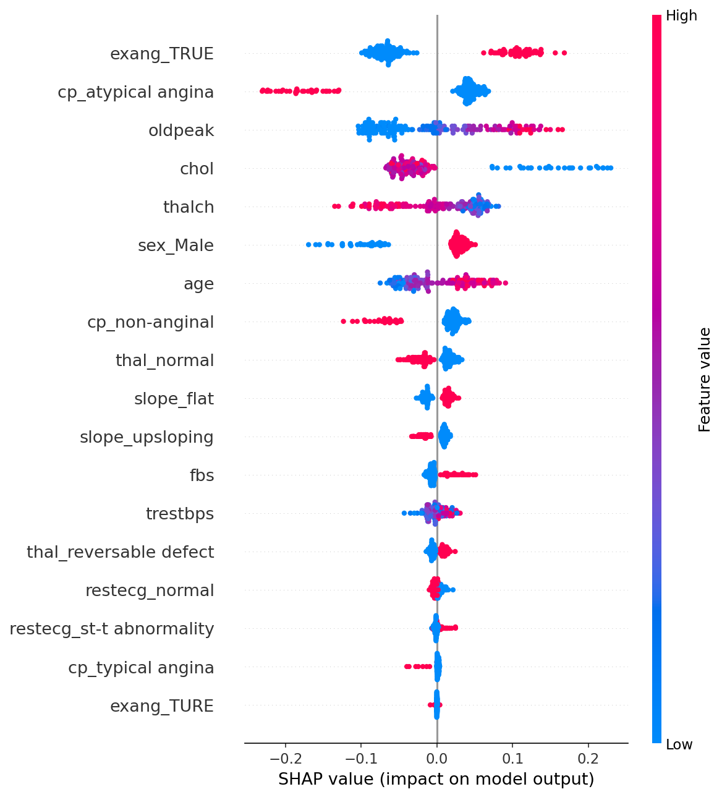
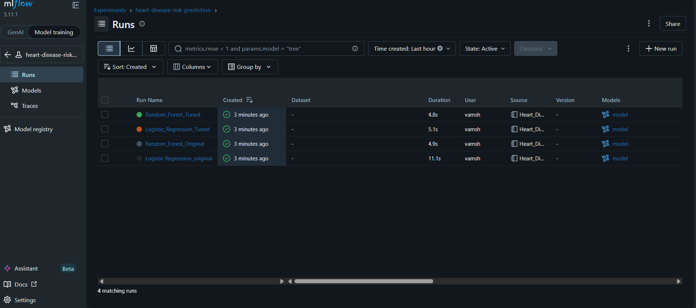

#  Heart Disease Risk Prediction — End-to-End ML Engineering Project

[](https://github.com/Chaithanya449/Heart-Disease-prediction-/actions)


> A production-grade binary classification system that predicts heart disease risk from clinical patient data. Built as a full ML Engineer pipeline — from EDA to deployed API with experiment tracking, model explainability, and CI automation.

**🔗 Live API:** [https://heart-disease-prediction-s8re.onrender.com](https://heart-disease-prediction-s8re.onrender.com)

---

## Problem Statement

Heart disease is the leading cause of death globally. Early detection using clinical indicators can save lives. This project builds a binary classifier to predict whether a patient has heart disease based on 13 clinical features, with emphasis on recall (minimizing missed disease cases).

**Dataset:** UCI Heart Disease Dataset — 908 rows, 13 features, binary target (disease / no disease)

---

## 🏗️ Project Architecture

```
Raw Data (908 rows)
        ↓
EDA + Feature Engineering
        ↓
7 Model Comparison + Cross Validation
        ↓
Hyperparameter Tuning (GridSearchCV + Pipeline)
        ↓
SHAP Explainability
        ↓
MLflow Experiment Tracking + Model Registry
        ↓
FastAPI /predict endpoint
        ↓
Docker Container
        ↓
GitHub Actions CI → Render Deployment
```

---

## ML Pipeline

### Data Preprocessing
- Identified 62 null values in `oldpeak` — applied **median imputation** (chosen over mean due to right-skewed distribution and outliers)
- Applied **one-hot encoding** with `drop_first=True` to avoid multicollinearity
- Used **stratified train-test split** (80/20) to maintain class distribution — critical for medical data
- Applied **StandardScaler** — essential for distance-based and regularized models

### Model Evaluation Strategy
- Evaluated **7 models** with classification report, cross-validation F1 (5-fold), and overfitting analysis
- Used **Pipeline + cross_val_score** to prevent data leakage during CV (scaler fits only on training folds)
- Primary metric: **F1 Score** (not accuracy) — more appropriate for medical domain
- Underfit threshold set at **0.80** — higher than standard due to medical domain requirements

---

## 📊 Model Comparison Results

| Model | Accuracy | CV F1 | CV Std | Train-Test Gap | Verdict |
|---|---|---|---|---|---|
| **Logistic Regression** | **79.12%** | **0.81** | 0.09 | 0.038 | ✅ **Selected** |
| SVM | 81.87% | 0.78 | 0.09 | 0.064 | ✅ Good fit |
| Random Forest | 78.02% | 0.78 | 0.09 | 0.22 | ⚠️ Overfit |
| KNN | 79.12% | 0.77 | 0.10 | — | ❌ Unstable |
| XGBoost | 75.82% | 0.75 | 0.08 | 0.24 | ❌ Overfit |
| Decision Tree | 70.33% | 0.70 | 0.07 | 0.29 | ❌ Overfit |
| Naive Bayes | 82.42% | 0.70 | 0.20 | -0.007 | ❌ Most unstable |

### Why Logistic Regression was selected

**1. Best balanced fit** — Train: 0.69 / Test: 0.79 / Gap: -0.007 (no overfitting)

**2. Strongest generalization metrics** — Highest CV F1 (0.81) with recall of 0.84 on disease class

**3. Dataset size** — At 908 rows, LR consistently outperforms tree-based models. RF and XGBoost showed train score of 1.0 (memorization), confirming they need significantly more data to generalize.

> "Logistic Regression selected as the production model due to balanced precision-recall tradeoff across both classes on a 908-row dataset. Tree-based models showed high variance at this data scale despite tuning."

---

## 🔍 SHAP Explainability

SHAP (SHapley Additive exPlanations) applied on Tuned Random Forest to understand feature contributions.



**Top features driving predictions:**

| Feature | Impact |
|---|---|
| `exang_TRUE` (exercise-induced angina) | Strongest predictor — presence pushes toward disease |
| `cp_atypical angina` (chest pain type) | Atypical pain reduces disease probability |
| `oldpeak` (ST depression) | High values = higher disease risk |
| `chol` (cholesterol) | High cholesterol = increased risk |
| `thalch` (max heart rate) | Lower max heart rate = disease risk |

Model learned clinically meaningful patterns — not just statistical noise.

---

## 📈 MLflow Experiment Tracking

All 4 runs tracked in MLflow with params, metrics, and model artifacts.



| Run | Accuracy | F1 | Recall |
|---|---|---|---|
| LR Original | 0.79 | 0.81 | 0.84 |
| LR Tuned | 0.78 | 0.79 | 0.73 |
| RF Original | 0.78 | 0.81 | 0.84 |
| RF Tuned | 0.72 | 0.80 | 0.98 |

**Winner → LR Original registered in MLflow Model Registry → Production stage**

---

## FastAPI Endpoint

**Base URL:** `https://your-render-url.onrender.com`

| Endpoint | Method | Description |
|---|---|---|
| `/` | GET | Health check |
| `/predict` | POST | Predict heart disease risk |
| `/docs` | GET | Interactive Swagger UI |

**Sample Request:**
```json
{
  "age": 61,
  "trestbps": 150,
  "chol": 243,
  "fbs": 1,
  "thalch": 137,
  "oldpeak": 1.0,
  "sex_Male": 1,
  "cp_atypical angina": 0,
  "cp_non-anginal": 1,
  "cp_typical angina": 0,
  "restecg_normal": 1,
  "restecg_st-t abnormality": 0,
  "exang_TRUE": 1,
  "exang_TURE": 0,
  "slope_flat": 1,
  "slope_upsloping": 0,
  "thal_normal": 1,
  "thal_reversable defect": 0
}
```

**Sample Response:**
```json
{
  "prediction": 0,
  "result": "No Heart Disease Detected",
  "confidence": 33.45
}
```

---

## 🛠️ Tech Stack

| Category | Tools |
|---|---|
| Data & EDA | pandas, numpy, matplotlib, seaborn |
| ML | scikit-learn, XGBoost |
| Explainability | SHAP |
| Experiment Tracking | MLflow 3.11 |
| API | FastAPI, uvicorn, pydantic |
| Containerization | Docker |
| Testing | pytest, httpx |
| CI Pipeline | GitHub Actions |
| Deployment | Render |

---

## 📁 Repository Structure

```
Heart-Disease-prediction-/
├── .github/
│   └── workflows/
│       └── ci.yml                  ← GitHub Actions CI pipeline
├── models/
│   ├── best_model.pkl              ← Production LR model
│   └── scaler.pkl                  ← Fitted StandardScaler
├── Heart_Disease_prediction.ipynb  ← Full ML pipeline notebook
├── app.py                          ← FastAPI application
├── test_main.py                    ← pytest tests (3 tests)
├── Dockerfile                      ← Container definition
├── requirements.txt                ← Dependencies
├── heart_disease.csv               ← Dataset
├── shap_summary_plot.png           ← SHAP feature importance plot
└── mlflow_experiments.png          ← MLflow experiment tracking screenshot
```

---

## ⚙️ Run Locally

```bash
git clone https://github.com/Chaithanya449/Heart-Disease-prediction-
cd Heart-Disease-prediction-
pip install -r requirements.txt
uvicorn app:app --reload
```

Open: `http://localhost:8000/docs`

---

## 🐳 Run with Docker

```bash
docker pull ck17041704/heart-disease-api:latest
docker run -p 8000:8000 ck17041704/heart-disease-api:latest
```

---

## ✅ Run Tests

```bash
pytest test_main.py -v
```

| Test | What it checks |
|---|---|
| `test_home` | API is running and returning correct response |
| `test_predict_valid_input` | Valid input returns prediction, result, confidence |
| `test_predict_invalid_input` | Invalid input returns 422 validation error |

---

## 🔄 CI Pipeline

On every push to `master`:
```
Push to GitHub → Install dependencies → Run pytest → Pass ✅ / Fail ❌
```
Ensures only tested code reaches deployment.

---

##  Key ML Engineering Decisions

| Decision | Reasoning |
|---|---|
| Median imputation for `oldpeak` | Right-skewed + outliers — mean would be inflated |
| Pipeline inside CV | Prevents data leakage — scaler fits only on training folds |
| F1 as primary metric | Accuracy misleading for medical data — F1 captures recall |
| LR over tree models | 908-row dataset — RF/XGBoost memorized training data (train=1.0) |
| Recall prioritized | False negatives (missed disease) costlier than false positives |
| Stratified split | Maintains class distribution — critical for imbalanced medical data |

---

## 👤 Author

**Chaitanya Krishna**

[](https://github.com/Chaithanya449)
